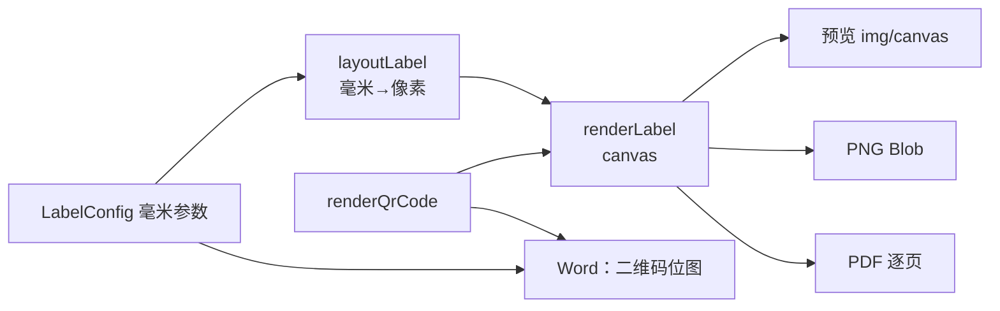

# 0001 · 渲染核与导出链路

- 状态：已执行
- 影响范围：`src/lib/units.ts`、`src/lib/types.ts`、`src/lib/fonts.ts`、`src/lib/render.ts`、`src/lib/export.ts`、`src/lib/exportImage.ts`、`src/lib/failures.ts`、`src/lib/download.ts`、`src/lib/batch.ts`、`src/export/run.ts`、`src/export/runImage.ts`
- 前置文档：无
- 生效版本：0.1.0（首版）→ 0.6.0（陆续随 [0006](../changes/0006-评审修复.md)、[0013](../changes/0013-加固-边界输入与失败可见.md)、[0014](../changes/0014-性能优化-首屏闭包与参数交互.md) 修订；本文是现状文档，随系统演进更新）

## 背景

需求是「输入标题与内容 → 出一张可打印的二维码标签，导出图片 / PDF / Word」。这里有一个容易做错的地方：如果预览用 DOM 排版、导出用截图，那么「屏幕上看到的」和「打印出来的」一定会有偏差（字体回退、亚像素、缩放、CSS 单位与毫米的换算）。

## 方案

**一个渲染核，两个出口。** 预览与导出共用同一条路径，差别只有缩放系数：

关键约定：

1. **毫米是版面真相，像素是导出真相**：`units.ts` 是唯一换算点，`mmToPx(mm, dpi)` / `pxToMm(px, dpi)` 成对出现，所有读数值都由像素回读成毫米。
2. **二维码按整数像素/模块落地**：先算 `modulePx = round(请求边长 / (矩阵模块数 + 2×静默区))`，再以 `modulePx × 模块数` 作为真实边长，绝不整体缩放——缩放一定让模块边界落在半像素上，打印发虚。真实边长会在读数条上报出来。
3. **纠错等级可回退**：内容塞不下时按 H→Q→M→L 依次尝试；回退后的**实际等级**会贯穿色标条、读数条与状态行（回退时读数写「L（请求 H）」）。
4. **渲染核 never-throw**（0013 起）：内容为空、内容超出二维码容量（四级全装不下）、画布分配失败（尺寸超过浏览器上限）都**不抛异常**，而是用 `RenderResult.failure` 表达——`qr_overflow` 时二维码位置画虚线占位框，`canvas_unavailable` 时产不出文件。抛出去会把整页打白（实测过），所以这条是硬约定。
5. **两道尺寸闸门**（0013 起）：二维码容量按版本 40 字节模式预检（L 2953 / M 2331 / Q 1663 / H 1273 字节）并报出真实字节数；导出画布超过 100 兆像素按 error 拦下（浏览器分配不出这么大的画布），60 兆像素起只是提醒。标题最多占版心高度六成，超出的行不印并把行数写进体检——免得把二维码挤成 1.2mm 的废码。
6. **印刷标记画在留白里**：裁切标记、色标条与规格读数、页边距参考虚线都落在页边距内，页边距不够时自动忽略并给出提醒。
7. **批量出码边渲染边写出**：A4 300 DPI 一页画布约 35 MB，攒齐两百页会把标签页撑爆，所以 PDF 走 `createPdfBuilder()` 逐页 AddImage 后立刻释放画布；Word 只带二维码位图（几十 KB），可整体组装。逐页都单独 try/catch：一页坏只跳过该页并把原因写进状态行，不连坐整批。
8. **导出器按需加载**（0014 起）：jsPDF / docx / fflate / read-excel-file 都是动态 import，只在点对应动作时加载——首屏闭包因此从 1569 kB 降到 693 kB（gzip 491 → 221 kB）。新增重库前先问它属于首屏还是某次动作。
9. **预览按显示像素渲染**（0014 起）：预览画布按台面实际显示尺寸（CSS px × DPR，受 `PREVIEW_MAX_PX` 封顶）渲染，而不是固定 1800px 再让浏览器缩小整张位图；二维码模块尺寸仍然只在导出网格上决定，`renderLabel` 的 `into` 参数让预览复用同一张画布。

## 导出格式的约定

| 格式 | 页面尺寸 | 内容 | 为什么这样做 |
| --- | --- | --- | --- |
| PNG | 画布原像素（= 毫米 × DPI） | 整张印张 | 交给打印店或贴进其他文档 |
| PDF | 页面毫米尺寸 = 印张毫米尺寸 | 整张印张作为无损 PNG（Flate）嵌入 | 直接送印；无损保证二维码可扫 |
| Word | `w:pgSz` = 印张毫米尺寸 | 标题是**可编辑文字**，二维码是图片 | 交付给别人还能改字 |

## 已知取舍

- PDF 走整页光栅而非矢量：二维码可扫优先于矢量清晰（二维码本身是位图模块，矢量也换不来更高精度）。代价是每页约 2.4 秒（300 DPI），进度会在状态行上报「第 n / 共 m 页」。
- Word 的标题不控制折行：docx 的 `TextRun` 只有单段落，靠 Word 自己按页宽折行；标签里的折行由 CSS/画布那侧负责。
- 导出画布有 100 兆像素硬上限（0013）：A4@600 约 35 兆、A3@600 约 70 兆都在限内，A4@1200（约 139 兆）会被拦下并说明怎么降——浏览器分配不出那么大的画布，宁可不产废件。

## 后续验证建议

- 换页面尺寸（横向 / 自定义）后，用 PDF 阅读器量 `/MediaBox` 是否为毫米换算值。
- 二维码边长改到很小（如 10 mm）时，读数条应提示「模块只有 N 像素，打印会发虚」。
- 用手机实扫打印件，覆盖纠错 M 与 H 两种等级。
- 渲染核的失败契约（0013）：把内容填到 5000 字符应看到占位框 + 容量报错、界面不白屏；把纸张设到 2000×2000mm @600 应看到兆像素 error 且不产文件。
- 首屏与预览（0014）：判「首屏是否回归」只看首屏闭包（入口 + 静态 import 链），不看入口 chunk 单文件大小；预览画布尺寸应等于台面显示像素（×DPR，受 `PREVIEW_MAX_PX` 封顶）而非固定 1800。
